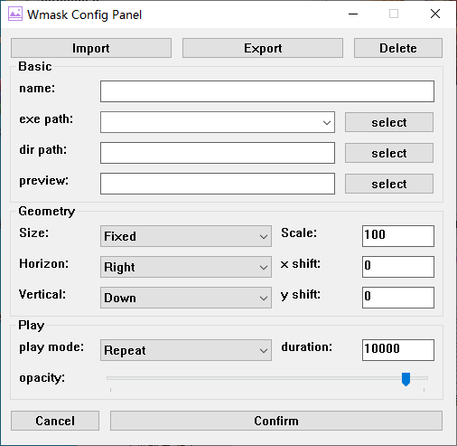
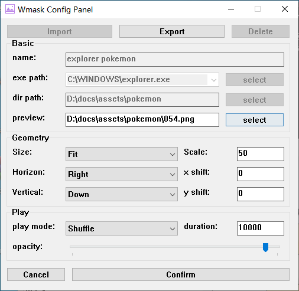

这是一个有趣的应用，它能给你的Windows窗口设置贴图、半透明背景或一些你想要显示的图片。

- [:sparkles: 应用特点](#sparkles-应用特点)
- [:world\_map:使用说明](#world_map使用说明)
- [:framed\_picture:使用案例](#framed_picture使用案例)
- [:triangular\_flag\_on\_post: 未来计划](#triangular_flag_on_post-未来计划)
- [:question: 疑惑？](#question-疑惑)

## :sparkles: 应用特点

- :zap:**极速响应无延迟**

| 父窗口启动时                            | 父窗口尺寸改变时                                             |
| --------------------------------------- | ------------------------------------------------------------ |
|   |  |
|  |  |

- :bulb:**占用极小不吃灰**

  采用GDI+渲染，不占用GPU资源，CPU、内存占用极少，可放心设置开机自启。

- :droplet:**纯净原生依赖少**

  整个应用采用Win32API开发，单可执行文件大小仅几百KB，无其他依赖，免安装。

  无注册表操作、不影响系统、**拒绝使用inject或hook技术！**

  配置文件位于可执行文件同目录下，不想要了？直接删除文件就行！

## :world_map:使用说明

- 应用采用托盘方式启动：

- 双击托盘打开主界面：

- 点击`New`新建配置：

  | 主界面                   | 配置窗口                   |
  | ------------------------ | -------------------------- |
  |  |  |

  - `Import/Export/Delete`: 导入/导出/删除配置
  - `name`: 配置名称（唯一且不可为空）
  - `exe path`: 匹配窗口可执行文件路径，点击下拉框显示当前正在运行的有效的窗口可执行文件路径
  - `dir path`: 图片文件夹路径
  - `preview`: 预览图图片路径
  - `Size`: 
    - `Fixed`: 固定尺寸，此时`Scale`代表与原图像大小比例百分值（一般用于固定大小的贴图）
    - `Fit`: 适合父窗口，此时`Scale`代表在Fit的基础上缩放百分值（一般用于响应尺寸的贴图）
    - `Fill`: 填充父窗口，此时`Scale`代表在Fit的基础上缩放百分值（一般用于设置半透明背景图片）
  - `Horizon`: 水平对齐方式；`xshift`: 水平偏移像素值
  - `Vertical`: 垂直对齐方式；`yshift`: 垂直偏移像素值
  - `play mode`: 
    - `Repeat`: 每当一个新的父窗口开启时，随机选一张图片并重复
    - `Loop`: 依次显示每张图片
    - `Shuffle`: 随机显示图片
  - `duration`: 每张图片显示时长（以毫秒为单位）
  - `opacity`: 不透明度
  - `Cancel/Confirm`: 取消/确认操作

- 在主界面选择一个配置，点击`Enable`即可启用配置，点击`Disable`即可禁用配置

- 在主界面选择一个配置，点击`Setting`可重新配置：

  | Enabled                   | Disabled                   |
  | ------------------------- | -------------------------- |
  |  |  |

  当配置已生效时有些部分的修改是不允许的

- 配置好后可直接关闭主界面，应用最小化到托盘，右击托盘列出目前所有配置：

  

  点击配置即可启用/禁用配置

- 右击托盘图标，点击`Quit Wmask`即可完全退出本应用

## :framed_picture:使用案例[^1]

[^1]: 图片无版权，需自行下载

## :triangular_flag_on_post: 未来计划

- [ ] 父窗口匹配机制不仅限于应用可执行文件，增加应用名称、窗口标题、桌面、缩览图、当前窗口、所有窗口等匹配方式。
- [ ] 增加配置组功能
- [ ] 增加动画功能（拟支持图片序列、视频、spine等方式）

## :question: 疑惑？

- Windows Defender报毒？参考[#2](https://github.com/wang606/Wmask/issues/2)
- more？[open a new issue](https://github.com/wang606/wmask/issues/new)!

